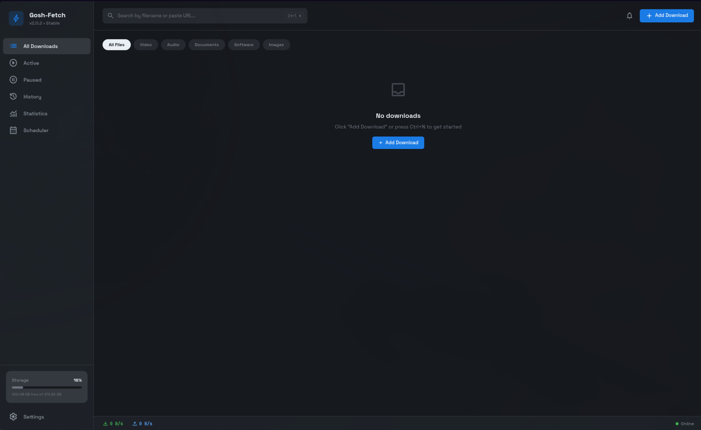
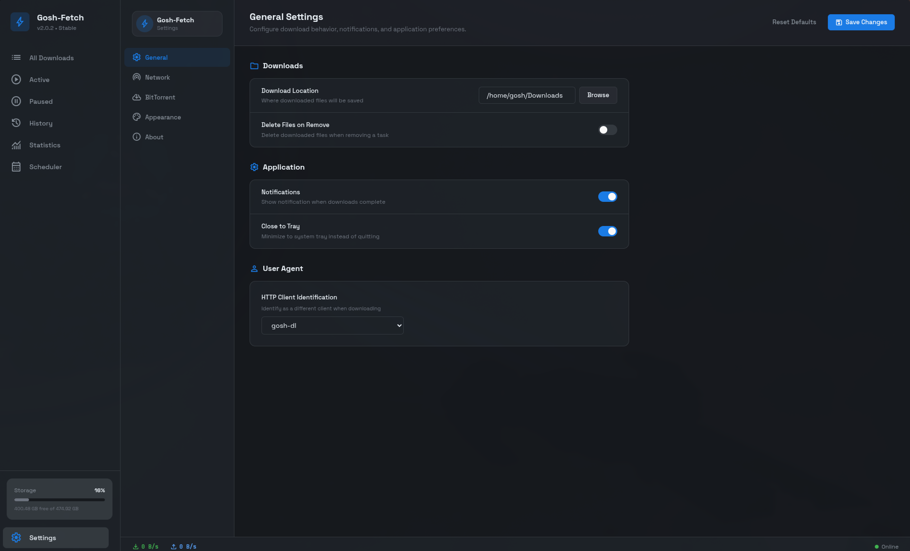

# Gosh-Fetch

A cross-platform download manager for Linux, Windows, and macOS. Built with Electron, React, and a native Rust download engine.

## Screenshots





## Features

Gosh-Fetch handles HTTP/HTTPS and BitTorrent downloads through gosh-dl, a native Rust engine built specifically for this project. It supports magnet links, multi-segment parallel downloads, and runs on all three major desktop platforms with dark and light themes.

There are no accounts, no telemetry, and no cloud features. Everything stays on your machine.

### Download Management

Downloads show real-time progress, speed, ETA, and connection metrics. You can pause, resume, retry, and cancel individual downloads, or use batch operations to act on multiple downloads at once with checkbox selection and select-all.

The queue supports drag-and-drop reordering, which automatically syncs with the priority system (critical, high, normal, low). Advanced per-download options include custom filename, save directory, speed limit, HTTP headers, connection count, checksum verification (SHA-256 and MD5), mirror/failover URLs, and sequential download mode for streaming media.

Completed downloads are available in the History page, where you can open files or their containing folders directly.

### BitTorrent

Full BitTorrent protocol support including torrent files and magnet links, DHT, PEX, and Local Peer Discovery. You get seeder/peer counts, configurable seed ratio, selective file download from multi-file torrents, and auto-updating tracker lists sourced from the community.

### Network and Reliability

- Concurrent downloads: 1-20 (default 5)
- Connections per server: 1-16 (default 8)
- Segments per download: 1-64 (default 8)
- Global and per-download speed limits
- HTTP/SOCKS proxy support
- Connection timeout (default 30s) and read timeout (default 60s)
- Automatic retry with configurable attempts (default 3)
- Custom user agent with browser presets (Chrome, Firefox, Wget, Curl)
- File allocation modes: none, sparse, full

### Desktop Integration

- System tray with live download/upload speed display and a popup showing active downloads
- Minimize to tray on close
- Window size, position, and maximized state persistence
- `.torrent` file association and `magnet:` protocol handler
- Drag and drop URLs, magnet links, or `.torrent` files onto the window
- Desktop notifications on download completion
- Keyboard shortcuts: `Ctrl+N` (add download), `Ctrl+K` (focus search), `Ctrl+,` (settings), `Ctrl+A` (select all)
- First-run onboarding with download path setup and system integration options
- Run at startup option
- Bandwidth scheduling with time-based rules

### Pages

The sidebar navigation provides access to: Downloads (with active/paused filters), History, Statistics, Scheduler, and Settings. A disk space widget in the sidebar shows remaining storage. A notification dropdown tracks download events (added, completed, failed).

## Download Engine

Gosh-Fetch uses [gosh-dl](https://github.com/goshitsarch-eng/gosh-dl), a native Rust download engine built specifically for this project.

| Feature | gosh-dl | External Tools |
|---------|---------|----------------|
| No external binaries | Yes | No |
| Memory safe | Yes (Rust) | Varies |
| Single binary distribution | Yes | No |
| Integrated error handling | Yes | Limited |

gosh-dl provides HTTP/HTTPS segmented downloads with automatic resume, full BitTorrent protocol support with DHT/PEX/LPD, async I/O built on Tokio, real-time progress events pushed to the frontend, a priority queue, bandwidth scheduling, mirror/failover management, and checksum verification.

gosh-dl is licensed under MIT. See the [gosh-dl repository](https://github.com/goshitsarch-eng/gosh-dl) for details.

## Architecture

```
+----------------------------------+
|  React 19 + Redux Toolkit (UI)   |
|  Vite dev server / built bundle  |
+----------------------------------+
|  Electron Main Process           |
|  IPC bridge, tray, auto-update   |
+----------------------------------+
|  gosh-fetch-engine (Rust)        |
|  JSON-RPC over stdin/stdout      |
|  SQLite for settings & history   |
+----------------------------------+
|  gosh-dl (Rust download engine)  |
|  HTTP, BitTorrent, async I/O     |
+----------------------------------+
```

The Rust sidecar (`gosh-fetch-engine`) runs as a child process managed by Electron. The main process communicates with it via JSON-RPC over stdin/stdout. The frontend receives real-time push events for download state changes (added, completed, failed, paused, resumed, etc.), with a 5-second heartbeat poll as fallback.

For more detail, see [docs/ARCHITECTURE.md](docs/ARCHITECTURE.md).

## Tech Stack

| Layer | Technology |
|-------|------------|
| Frontend | React 19, Redux Toolkit, React Router 7, TypeScript |
| Build | Vite 7, electron-builder |
| Desktop | Electron 40 |
| Backend | Rust (Tokio, rusqlite, serde) |
| Engine | gosh-dl 0.3.2 |
| Icons | Material Symbols Outlined (self-hosted), lucide-react (legacy) |
| Drag & Drop | dnd-kit |
| Testing | Vitest, React Testing Library, Rust `#[test]` |

## Installation

### Arch Linux (AUR)

```bash
yay -S gosh-fetch-bin
```

Available as [`gosh-fetch-bin`](https://aur.archlinux.org/packages/gosh-fetch-bin) on the AUR. Installs the prebuilt AppImage with a desktop entry, icons, `.torrent` file association, and `magnet:` URI handler.

### Other Linux / Windows / macOS

Download the latest release from the [Releases](https://github.com/goshitsarch-eng/Gosh-Fetch/releases) page.

| Platform | Formats |
|----------|---------|
| Linux | AppImage, .deb, .rpm |
| macOS | .dmg |
| Windows | NSIS installer, portable |

## Building from Source

### Requirements

### All Platforms

- [Node.js](https://nodejs.org/) 20+
- [Rust](https://rustup.rs/) 1.77+

### Linux

No additional system dependencies required beyond Node.js and Rust.

### macOS

- Xcode Command Line Tools

### Windows

- No additional dependencies

## Building

```bash
# Install dependencies
npm install

# Build the Rust engine
cargo build --release --manifest-path src-rust/Cargo.toml

# Development (frontend + Electron)
npm run dev                # Vite dev server on port 5173
npm run build:electron     # Compile Electron main process
npx electron .             # Launch the app

# Or use the combined dev command
npm run electron:dev

# Production build
npm run electron:build

# Run tests
npm test                   # Frontend tests (Vitest)
cargo test --manifest-path src-rust/Cargo.toml  # Rust tests
```

## Usage

1. **Add Download** -- Click "Add Download" or press `Ctrl+N`. Enter a URL, magnet link, or browse for a `.torrent` file. Expand "Advanced Options" for filename, directory, speed limit, headers, priority, checksum, mirrors, and more.
2. **Monitor** -- Watch real-time speed, progress, ETA, and peer info. Filter by Active, Paused, or view all.
3. **Manage** -- Pause, resume, retry, or remove downloads. Select multiple with checkboxes for batch operations. Drag to reorder priority.
4. **History** -- View completed downloads and open files or folders directly.
5. **Statistics** -- View download statistics and trends.
6. **Scheduler** -- Set up bandwidth scheduling rules based on time of day.

You can also drag URLs, magnet links, or `.torrent` files directly onto the app window.

## Privacy

- No telemetry or analytics
- No data collection
- No network activity unless explicitly initiated by you
- All data stored locally on your device

## Disclaimer

This software is licensed under the GNU Affero General Public License v3.0 (AGPL-3.0). It is provided "as is", without warranty of any kind, express or implied, including but not limited to the warranties of merchantability or fitness for a particular purpose. Use at your own risk.

## License

AGPL-3.0 - See [LICENSE](LICENSE)

The gosh-dl download engine is licensed under MIT.

## Roadmap

Planned features for future releases:

- **Browser Extension** -- One-click downloads from your browser
- **RSS Feed Support** -- Automatic downloads from RSS/podcast feeds
- **Download Categories** -- Organize downloads by type with custom save locations
- **Import/Export** -- Backup and restore download history and settings

## Contributing

Contributions welcome. See [CONTRIBUTING.md](CONTRIBUTING.md) for development setup and guidelines.
